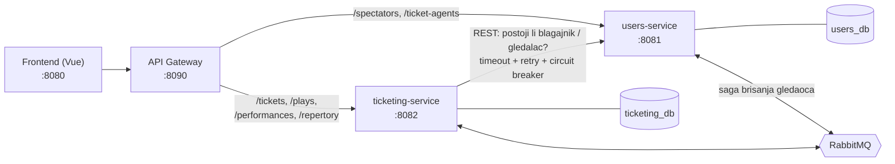

# Pozorište: od monolita do mikroservisa

Projekat za kurs *Razvoj poslovnih sistema* (prof. Gordana Rakić). Postojeća aplikacija za prodaju pozorišnih ulaznica (Spring Boot + Vue) podeljena je iz monolita na **dva mikroservisa** sa API Gateway-om, a zatim je izmereno i testirano šta se podelom dobilo i izgubilo.

Šta je urađeno:

- **analiza granica modula** alatom Spring Modulith i odluka o podeli na 2 servisa;
- **fizička podela**: `users-service` i `ticketing-service`, svaki sa svojom bazom;
- **komunikacija i otpornost**: sinhroni REST sa timeout-om, retry-jem i circuit breaker-om, i **saga** (koreografija preko RabbitMQ-a) za brisanje gledaoca;
- **API Gateway** kao jedina ulazna tačka za frontend;
- **CI/CD po servisu**: GitHub Actions workflow-i sa path filterima, testovi i Docker image na ghcr.io;
- **merenje performansi pre i posle podele** (k6);
- **fuzz testiranje** (Schemathesis) u dva kruga, pre i posle ispravki;
- **44 testa** servisa koji se pokreću u CI-ju.

Detaljan izveštaj sa svim odlukama, merenjima i nalazima: **[docs/REPORT.md](docs/REPORT.md)**.

## Arhitektura



| Komponenta | Port | Baza | Odgovornost |
|---|---|---|---|
| `services/users-service` | 8081 | `users_db` | blagajnici (prijava) i gledaoci |
| `services/ticketing-service` | 8082 | `ticketing_db` | predstave, izvođenja, repertoar, sale i prodaja karata |
| `services/api-gateway` | 8090 | — | rutiranje zahteva ka servisima (Spring Cloud Gateway MVC) |
| `frontend/pozoriste-app` | 8080 | — | Vue aplikacija za blagajnike |
| `backend/demo` | 8084 | `pozoriste` | originalni monolit, polazna tačka za poređenje |

**Zašto 2 servisa, a ne 4 koliko je predložio Spring Modulith:** ovakva podela ostavlja samo 2 mrežna poziva (ticketing → users), dok bi 4 servisa dala više mrežnih poziva bez nove vrednosti za projekat ([REPORT, sekcija 3](docs/REPORT.md#3-odluka-2-servisa-umesto-4)).

**Saga brisanja gledaoca:** brisanje gledaoca u `users-service` ne sme ostaviti njegove karte u `ticketing_db` bez vlasnika. Zato `DELETE /spectators/{jmbg}` vraća `202 Accepted`, gledalac prelazi u `DELETION_PENDING`, a `ticketing-service` odlučuje: ako gledalac ima karte za buduća izvođenja, brisanje se odbija i gledalac se vraća u `ACTIVE` (kompenzacija); inače se karte za prošla izvođenja anonimizuju i gledalac se briše ([REPORT, sekcija 11.3](docs/REPORT.md#113-saga-brisanja-gledaoca-koreografija-rabbitmq)).

## Tehnologije

Java 17, Spring Boot 3.3, Spring Data JPA, PostgreSQL, Spring Cloud Gateway MVC, Resilience4j, RabbitMQ (Spring AMQP), Bean Validation, springdoc-openapi, JUnit 5 + Mockito, Vue 3, Docker, GitHub Actions, k6, Schemathesis.

## Struktura repozitorijuma

```
backend/demo/            originalni monolit (polazna tačka)
services/users-service/  mikroservis: blagajnici i gledaoci
services/ticketing-service/  mikroservis: predstave, izvođenja i karte
services/api-gateway/    API Gateway
frontend/pozoriste-app/  Vue frontend
.github/workflows/       CI/CD, jedan workflow po servisu
perf/                    k6 benchmark, skripte za pokretanje, rezultati merenja
fuzz/                    skripta za Schemathesis i izveštaji oba kruga
docs/REPORT.md           detaljan izveštaj
```

## Pokretanje lokalno

### Preduslovi

- Java 17
- PostgreSQL (lokalno, korisnik `postgres` / `postgres`)
- Docker (za RabbitMQ i Mailpit)
- Node.js (za frontend)

### 1. Baze

```sql
CREATE DATABASE users_db;
CREATE DATABASE ticketing_db;
```

Tabele pravi Hibernate pri prvom pokretanju servisa (`ddl-auto=update`).

### 2. RabbitMQ i Mailpit

```bash
docker run -d --name rabbitmq --hostname rabbit -u rabbitmq -p 5672:5672 -p 15672:15672 rabbitmq:3-management
docker run -d --name mailpit -p 1025:1025 -p 8025:8025 axllent/mailpit
```

`-u rabbitmq` je potreban na Docker Desktop-u za Windows. Konzola RabbitMQ-a je na http://localhost:15672 (guest/guest), a mejlovi potvrde kupovine se vide na http://localhost:8025.

### 3. Lokalna konfiguracija servisa

`application.properties` čita podešavanja iz env varijabli. Za lokalni rad napravi `src/main/resources/application-local.properties` u oba servisa (fajl nije u git-u):

`services/users-service/src/main/resources/application-local.properties`
```properties
spring.datasource.url=jdbc:postgresql://localhost:5432/users_db
spring.datasource.username=postgres
spring.datasource.password=postgres
```

`services/ticketing-service/src/main/resources/application-local.properties`
```properties
spring.datasource.url=jdbc:postgresql://localhost:5432/ticketing_db
spring.datasource.username=postgres
spring.datasource.password=postgres
users.service.url=http://localhost:8081
# mejl potvrde ide na lokalni Mailpit
spring.mail.host=localhost
spring.mail.port=1025
spring.mail.username=pozoriste@example.com
spring.mail.password=
spring.mail.properties.mail.smtp.auth=false
spring.mail.properties.mail.smtp.starttls.enable=false
spring.mail.properties.mail.smtp.starttls.required=false
```

RabbitMQ se podrazumevano traži na `localhost:5672` (guest/guest), pa za njega nije potrebna dodatna konfiguracija.

### 4. Servisi i gateway

Svaki u svom terminalu (Git Bash; u cmd-u umesto `./mvnw` koristi `mvnw.cmd`):

```bash
cd services/users-service     && ./mvnw spring-boot:run -Dspring-boot.run.profiles=local
cd services/ticketing-service && ./mvnw spring-boot:run -Dspring-boot.run.profiles=local
cd services/api-gateway       && ./mvnw spring-boot:run
```

Provera: `curl http://localhost:8090/plays` treba da vrati listu predstava (prazan niz ako baza nema podataka).

### 5. Frontend

```bash
cd frontend/pozoriste-app
npm ci
npm run serve
```

Aplikacija je na http://localhost:8080 i sve zahteve šalje gateway-u (`VUE_APP_API_BASE_URL`, podrazumevano `http://localhost:8090`). Za prijavu je potreban blagajnik u tabeli `teatar_radnik` baze `users_db`.

## Testovi

```bash
cd services/users-service     && ./mvnw test    # 19 testova
cd services/ticketing-service && ./mvnw test    # 25 testova
```

Testovi ne traže bazu ni RabbitMQ (Mockito i `@WebMvcTest`). Pokrivaju sagu, kupovinu karte, validaciju ulaza, handler grešaka i klijent prema users-service-u ([REPORT, sekcija 12](docs/REPORT.md#12-testovi-servisa)). U Eclipse-u: desni klik na projekat → *Run As → JUnit Test*.

## CI/CD

Svaki servis ima svoj workflow u `.github/workflows/`, koji se pokreće samo kad se promeni taj servis:

1. **build** — `./mvnw -B verify`: testovi i JAR;
2. **docker** — samo na push u `main` i samo ako je build prošao: Docker image se objavljuje na `ghcr.io/dajanajandric/<servis>` sa tagovima `sha-<commit>` i `latest`.

## Rezultati

### Performanse (k6, monolit → servisi)

Isti podaci i ista mašina; monolit direktno, servisi preko gateway-a. Medijana vremena odziva, prosek 3 kruga:

| Zahtev | Monolit | Servisi |
|---|---|---|
| Jednostavna čitanja (`/plays`, `/spectators/{jmbg}`, …) | 15–21 ms | ~34 ms |
| Slobodna mesta | 35 ms | 19 ms |
| Kupovina karte (`POST /tickets`) | 57 ms | 44 ms |

Propusnost: pregled ~510 → ~493 zahteva/s, kupovina ~54 → ~84 karte/s. Jednostavna čitanja su sporija zbog dodatnog skoka kroz gateway, a kupovina je brža jer karta u `ticketing-service` više ne učitava blagajnika i gledaoca kroz JPA relacije ([REPORT, sekcija 9](docs/REPORT.md#9-merenje-performansi-pre-i-posle-podele)).

Pokretanje: `perf/start-all.sh`, pa `perf/run.sh monolith` i `perf/run.sh services`.

### Fuzz testiranje (Schemathesis)

| Meta | Greške 5xx, 1. krug | Greške 5xx, 2. krug (posle ispravki) |
|---|---|---|
| monolit (nepromenjen) | 10 | — |
| users-service | 2 | **0** |
| ticketing-service | 9 | **0** |

Najvažniji nalaz postojao je samo kod mikroservisa: ID blagajnika poput `{x}` rušio je poziv ka users-service-u, circuit breaker je to brojao kao kvar, i posle 5 takvih zahteva **svaka** kupovina je 10 sekundi dobijala 503. Ispravke: validacija ulaza, globalni handler grešaka, siguran REST klijent i circuit breaker koji broji samo stvarne kvarove ([REPORT, sekcije 10 i 11](docs/REPORT.md#10-fuzz-testiranje)).

Pokretanje: `fuzz/run.sh monolith|users|ticketing` (vraća baze iz backup-a pre svakog pokretanja).

## Poznata ograničenja

- Saga nema *transactional outbox*: upis u bazu i objava događaja nisu atomični.
- Gateway pod opterećenjem retko vrati 500 zbog greške u JDK `HttpClient`-u (3 puta u preko 100.000 zahteva).
- Merenja su rađena na jednom računaru, pa pokazuju trend, a ne brojke za produkciju.
- Pravi deploy na server nije deo projekta; pipeline se završava Docker image-om u registry-ju.
